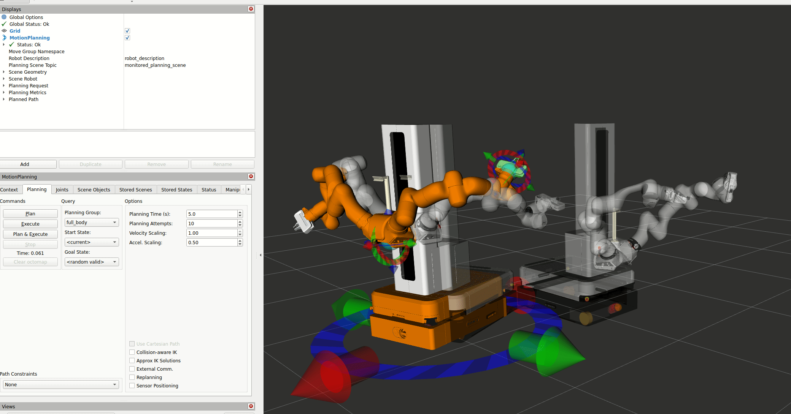

# mobile FR3 Duo Moveit Integration

## Moveit Setup Assistant


```sh
sudo apt install ros-jazzy-gz-ros2-control
sudo apt install ros-jazzy-moveit
sudo apt install ros-jazzy-moveit-setup-assistant


ros2 launch moveit_setup_assistant setup_assistant.launch.py
```

> [!WARNING]
> There is an  rviz bug: https://github.com/moveit/moveit2/issues/3546, which will cause the assistant to crash when trying to load the URDF

To fix that issue do this:

```sh
sudo apt install wget
wget http://snapshots.ros.org/jazzy/2025-05-23/ubuntu/pool/main/r/ros-jazzy-rviz-common/ros-jazzy-rviz-common_14.1.11-1noble.20250520.201719_amd64.deb

sudo apt remove ros-jazzy-rviz2
sudo dpkg -i ros-jazzy-rviz-common_14.1.11-1noble.20250520.201719_amd64.deb
```

When selecting `src/franka_description/robots/mobile_fr3_duo_v0_2/mobile_fr3_duo_v0_2.urdf.xacro` for the URDF, you may want to add arguments like these `hand:="false" load_gripper:="false" ee_id:="None"`

Follow the [setup_assistant_tutorial](https://moveit.picknik.ai/main/doc/examples/setup_assistant/setup_assistant_tutorial.html).

### MoveGroups

For the mobile base, defining a planar joint was useful for planning. TBD if this can stay.
This move group structure worked for me:

```xml
    <group name="right_arm">
        <joint /> <!-- same as tutorial -->
    </group>
    <group name="left_arm">
        <joint /> <!-- same as tutorial -->
    </group>
    <group name="mobile_base">
        <joint name="planar_x"/> <!-- important -->
        <joint name="planar_y"/> <!-- important -->
        <joint name="planar_theta"/> <!-- important -->
    </group>
    <group name="spine">
        <joint name="franka_spine_vertical_joint"/> <!-- maybe drop until actions are there -->
    </group>
    <group name="left_hand">
        <link /> <!-- same as tutorial -->
    </group>
    <group name="right_hand">
        <link /> <!-- same as tutorial -->
    </group>
    <group name="full_body">
        <group name="right_arm"/>
        <group name="left_arm"/>
        <group name="mobile_base"/>
        <group name="spine"/>
    </group>
```

With these settings, the complete configs can be generated.

### Joint Limits

The planner won't succeed if a joint belonging to the move group, was not manually configured in the `joint_limits.yaml` to have a `has_acceleration_limits: true` and a `max_acceleration: <value>`.


## Demo

Build, source and launch the created package like this:

```sh
colcon build --packages-select franka_mobile_fr3_duo_moveit_config
source install/setup.bash
export ROS_DOMAIN_ID=201 # optional but recommended 
ros2 launch franka_mobile_fr3_duo_moveit_config moveit.launch.py
```

In Rviz, select `full_body` as "Planning Group", `<random_valid>` as "Goal State" and increase the "Velocity Scaling" and "Accel. Scaling", then click "Plan" for a quick demo, or play with the 3D markers to your liking:

