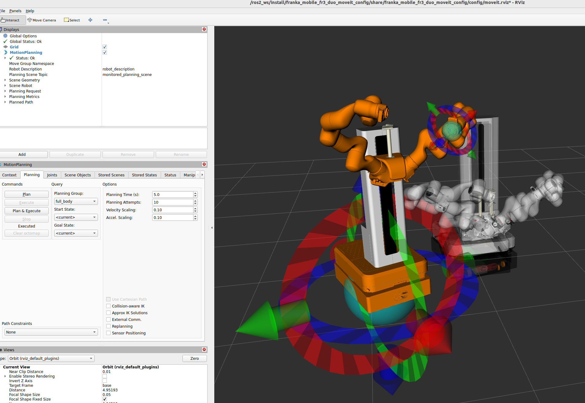

franka_mobile_fr3_duo_moveit_config
===================================

This package contains the configuration for for the Mobile FR3 Duo with MoveIt 2.

Move Group
----------

There are 3 move groups called ``left_arm``, ``right_arm`` and ``mobile_base`` and one group ``full_Body`` combining them all. There is also a move group for the ``spine``, which you can use for planning and visualization, but it currently lacks support to move the real hardware or simulation.

Configuration Files
-------------------

In the `config` folder you will find:

* Motion planning configuration for the Mobile FR3 Duo (`moveit_defaults.json`)
* Joint limits (`joint_limits.yaml`)
* Kinematics solver configuration (`kinematics.yaml`)
* ROS 2 controller configuration (`mobile_fr3_duo_controllers.yaml`)
* MoveIt controller configuration (`moveit_controllers.yaml`)

Planning groups and collisions are defined in the `mobile_fr3_duo.srdf.xacro` in the `franka_description` package.

Usage
-----

.. code-block:: shell

    colcon build --packages-up-to franka_mobile_fr3_duo_moveit_config
    ros2 launch franka_mobile_fr3_duo_moveit_config moveit.launch.py # for the real robot
    ros2 launch franka_mobile_fr3_duo_moveit_config moveit.launch.py simulate_in_gazebo:=true # gazebo simulation

    Move the marker-handles to define your goal state. Then click ``Plan & Execute`` and observe the robot move.